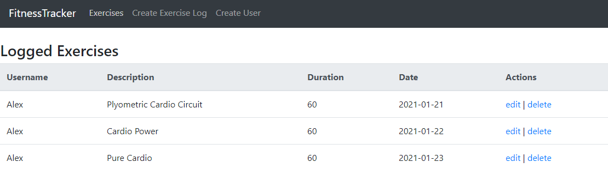

# FitnessTracker

<h1 id="intro">Introduction</h1>
Fitness Tracker is a full-stack web application where users can keep track of their exercise habits.  The app features full CRUD functionality where users can retrieve, edit, delete, and add to their logged exercises.    

<!-- <h1 id="user_guide">User Guide</h1> -->
<!-- Go to <a href="https://talkybox.herokuapp.com">talkybox.herokuapp.com</a> to see Talkybox in action! -->

## To start the app:

### Run

### `go run main.go`

Open localhost:5000 to open the app in the browser.
<h1 id="tech_stack">Tech Stack</h1>
Front-end: React  
Back-end: Golang, PostgreSQL